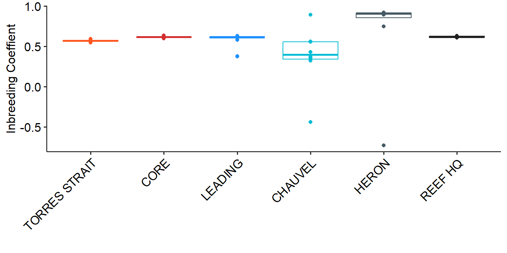
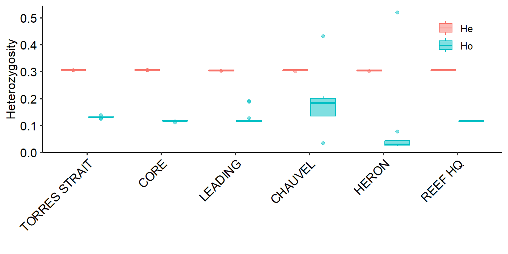
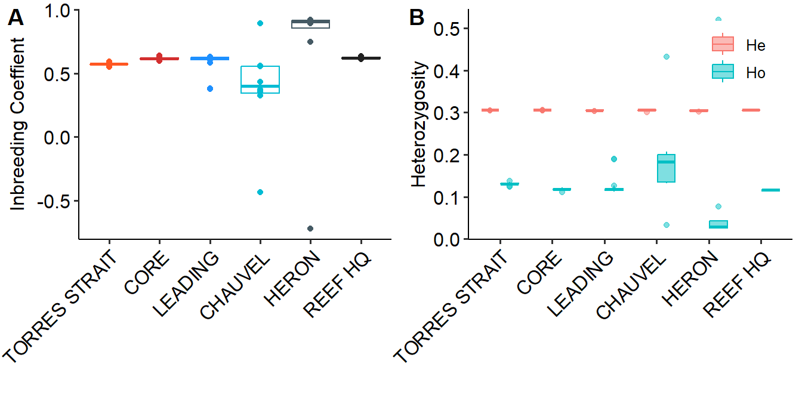

0.2Demographic patterns
================

# Observed and expected heterozygosity

We used plink2 to calculate heterozygosity per sample using the
following command

``` bash
plink2 --vcf gatk.filteredv3.vcf.gz --allow-extra-chr --het --bad-freqs
```

As part of this calculation PLINK provides the observed and expected
heterozygosity (Ho, He) as well as the inbreeding coefficient **F**
which is calculated as $1-\frac{H0}{He}$

To create plot look at [Rmarkdown_files/02.demographic_patterns](https://github.com/schmidte10/apoly_pop_gen/blob/main/Rmarkdown_files/02.demographic_patterns.Rmd)



