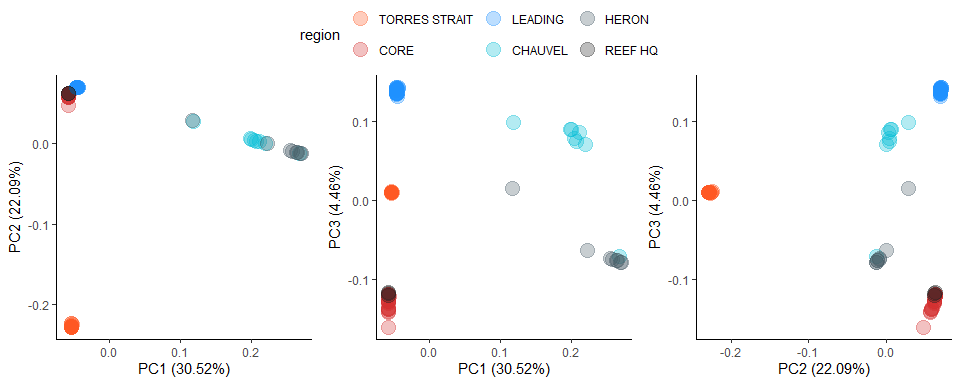
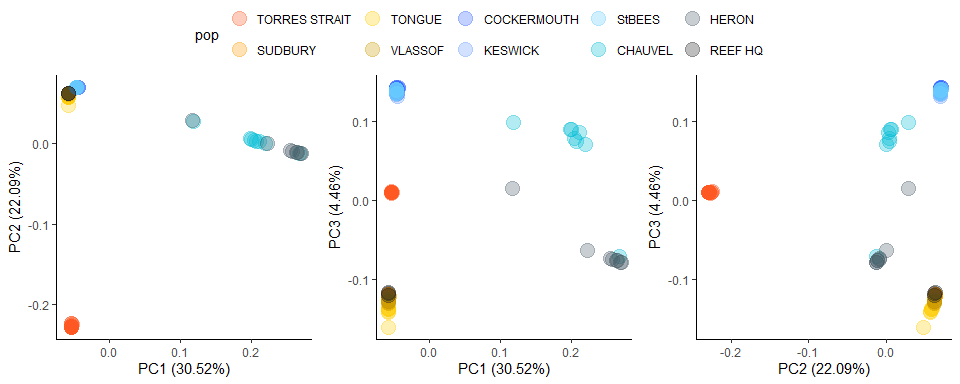
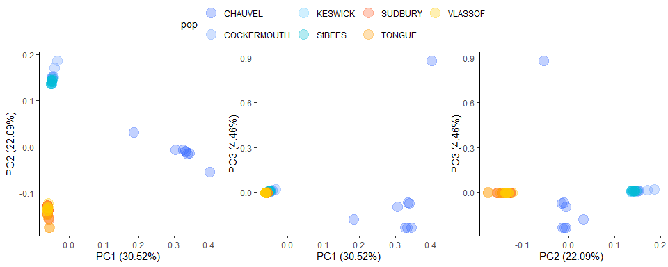

03.Ordinations
================

# Additional filtering (optional)

Before continuing we will complete some additional filtering steps. When
looking at population structure we will create 4 different .vcf files to
help determine what impact our filtering steps have on our results. The
four VCF files we create will be:

- stringent_studywide
- relaxed_studywide
- stringent_within
- relaxed within

**Stringent** and **relaxed** refer to the threshold filters.
**studywide** and **within** refer to if the condition **mac** was taken
using the dataset as a whole or within each population.

To complete the next filtering steps we will use a combination of
*vcftools* and the snpR package in *R* (hwe)

The table below outlines the conditions that each .vcf will have

``` bash
vcftools --gzvcf ../gatk/gatk.filtered.vcf.gz \
--max-missing 0.5 --min-meanDP 10 --max-meanDP 30 \
--minDP 3 --minGQ 40 --mac 4 --remove-filtered-geno-all --recode \
--recode-INFO-all --stdout | \
gzip > gatk.filtered.stringent_studywide.vcf.gz 

vcftools --gzvcf ../gatk/gatk.filtered.vcf.gz \
--max-missing 0.5 --min-meanDP 10 --max-meanDP 30 \
--minDP 3 --minGQ 40 --mac 2 --remove-filtered-geno-all --recode \
--recode-INFO-all --stdout | \
gzip > gatk.filtered.relaxed_studywide.vcf.gz 

vcftools --gzvcf ../gatk/gatk.filtered.vcf.gz \
--max-missing 0.5 --min-meanDP 10 --max-meanDP 30 \
--minDP 3 --minGQ 40 --remove-filtered-geno-all --recode \
--recode-INFO-all --stdout | \
gzip > gatk.filtered.within.vcf.gz
```

# PLINK2 PCA 

Code below does not use additional filtering option.

``` bash
plink2 --vcf ./gatk/gatk.filteredv3.vcf.gz --make-pgen --allow-extra-chr --out ./03.Ordinations/gatk.filteredv3
plink2 --pfile ./03.Ordinations/gatk.filteredv3 --allow-extra-chr --pca --out ./03.Ordinations/gatk.filteredv3.pca
```

# Plotting in R 

Code below can also be found in [Rmarkdown_files/03.Ordinations_R.Rmd](https://github.com/schmidte10/apoly_pop_gen/blob/main/Rmarkdown_files/03.Ordinations_R.Rmd)

``` r
library(tidyverse) 
library(ggpubr)
```

``` r
gatk_filteredv3_pca <- read_table("C:/Users/jc527762/OneDrive - James Cook University/PhD dissertation/Data/Chapter2_Genetics/03.Ordinations_NEW/gatk.filteredv3.pca.eigenvec")
```

    ## 
    ## ── Column specification ────────────────────────────────────────────────────────
    ## cols(
    ##   `#IID` = col_character(),
    ##   PC1 = col_double(),
    ##   PC2 = col_double(),
    ##   PC3 = col_double(),
    ##   PC4 = col_double(),
    ##   PC5 = col_double(),
    ##   PC6 = col_double(),
    ##   PC7 = col_double(),
    ##   PC8 = col_double(),
    ##   PC9 = col_double(),
    ##   PC10 = col_double()
    ## )

``` r
region.list <- factor(rep(c("CORE", "CHAUVEL","LEADING","HERON","LEADING","TORRES STRAIT","REEF HQ"), c(24, 8, 8, 8, 16, 15, 3)))  
pop <- factor(rep(c("SUDBURY","TONGUE", "VLASSOF", "CHAUVEL","COCKERMOUTH","HERON","KESWICK","StBEES","TORRES STRAIT","REEF HQ"), 
                  c(9,7,8, 8, 8, 8, 8, 8, 15, 3)))  
mycol=c("#FF5722","#D32F2F","dodgerblue","#00BCD4","#455A64","#212121") 
mycol.pop=c("#FF5722","#FF9900","#FFCC00","#CC9900","#3366FF","#6699FF","#66CCFF","#00BCD4","#455A64","#212121")
```

``` r
gatk_filteredv3_pca2 <- gatk_filteredv3_pca |> 
  cbind(region.list, pop) |> 
  rename(Sample = `#IID`, 
         region = region.list) |> 
  mutate(region=fct_relevel(region, c("TORRES STRAIT","CORE","LEADING","CHAUVEL","HERON","REEF HQ")),
         pop = fct_relevel(pop, c("TORRES STRAIT","SUDBURY","TONGUE", "VLASSOF",
                                  "COCKERMOUTH","KESWICK","StBEES","CHAUVEL","HERON","REEF HQ")))
```

``` r
pc12 <-ggplot(gatk_filteredv3_pca2, aes(x=PC1, y=PC2, color=region)) + 
  geom_point(size=5, alpha=0.3) + 
  xlab("PC1 (30.52%)") + ylab("PC2 (22.09%)") +
  theme_classic() + 
  scale_color_manual(values = mycol) +
  theme(legend.position = "none")

pc13 <-ggplot(gatk_filteredv3_pca2, aes(x=PC1, y=PC3, color=region)) + 
  geom_point(size=5, alpha=0.3) + 
  xlab("PC1 (30.52%)") + ylab("PC3 (4.46%)") +
  theme_classic() +  
  scale_color_manual(values = mycol) +
  theme(legend.position = "none")

pc23 <-ggplot(gatk_filteredv3_pca2, aes(x=PC2, y=PC3, color=region)) + 
  geom_point(size=5, alpha=0.3) + 
  xlab("PC2 (22.09%)") + ylab("PC3 (4.46%)") +
  theme_classic() +  
  scale_color_manual(values = mycol) +
  theme(legend.position = "none")

ggarrange(pc12,pc13,pc23, 
          nrow = 1, 
          ncol = 3, 
          common.legend = TRUE)
```



``` r
pc12 <-ggplot(gatk_filteredv3_pca2, aes(x=PC1, y=PC2, color=pop)) + 
  geom_point(size=5, alpha=0.3) + 
  xlab("PC1 (30.52%)") + ylab("PC2 (22.09%)") +
  theme_classic() + 
  scale_color_manual(values = mycol.pop) +
  theme(legend.position = "none")

pc13 <-ggplot(gatk_filteredv3_pca2, aes(x=PC1, y=PC3, color=pop)) + 
  geom_point(size=5, alpha=0.3) + 
  xlab("PC1 (30.52%)") + ylab("PC3 (4.46%)") +
  theme_classic() +  
  scale_color_manual(values = mycol.pop) +
  theme(legend.position = "none")

pc23 <-ggplot(gatk_filteredv3_pca2, aes(x=PC2, y=PC3, color=pop)) + 
  geom_point(size=5, alpha=0.3) + 
  xlab("PC2 (22.09%)") + ylab("PC3 (4.46%)") +
  theme_classic() +  
  scale_color_manual(values = mycol.pop) +
  theme(legend.position = "none")

ggarrange(pc12,pc13,pc23, 
          nrow = 1, 
          ncol = 3, 
          common.legend = TRUE)
```



``` r
gatk_filteredv3_pca <- read_table("C:/Users/jc527762/OneDrive - James Cook University/PhD dissertation/Data/Chapter2_Genetics/03.Ordinations_NEW/gatk.filtered.relaxed_studywide_primary.pca.eigenvec")
```

    ## 
    ## ── Column specification ────────────────────────────────────────────────────────
    ## cols(
    ##   `#IID` = col_character(),
    ##   PC1 = col_double(),
    ##   PC2 = col_double(),
    ##   PC3 = col_double(),
    ##   PC4 = col_double(),
    ##   PC5 = col_double(),
    ##   PC6 = col_double(),
    ##   PC7 = col_double(),
    ##   PC8 = col_double(),
    ##   PC9 = col_double(),
    ##   PC10 = col_double()
    ## )

``` r
region.list <- factor(rep(c("LEADING", "CORE"), c(32, 24)))  
mycol=c("#D32F2F","dodgerblue")  
pop <- factor(rep(c("KESWICK","CHAUVEL","COCKERMOUTH","StBEES","SUDBURY","TONGUE", "VLASSOF"), 
                  c(8,8,8, 8, 9, 7, 8)))  
mycol=c("#FF5722","#D32F2F","dodgerblue","#00BCD4","#455A64","#212121") 
mycol.pop=c("#3366FF","#6699FF","#66CCFF","#00BCD4","#FF5722","#FF9900","#FFCC00")
gatk_filteredv3_pca$region <- region.list
gatk_filteredv3_pca$pop <- pop
```

``` r
pc12 <-ggplot(gatk_filteredv3_pca, aes(x=PC1, y=PC2, color=pop)) + 
  geom_point(size=5, alpha=0.3) + 
  xlab("PC1 (30.52%)") + ylab("PC2 (22.09%)") +
  theme_classic() + 
  scale_color_manual(values = mycol.pop) +
  theme(legend.position = "none")

pc13 <-ggplot(gatk_filteredv3_pca, aes(x=PC1, y=PC3, color=pop)) + 
  geom_point(size=5, alpha=0.3) + 
  xlab("PC1 (30.52%)") + ylab("PC3 (4.46%)") +
  theme_classic() +  
  scale_color_manual(values = mycol.pop) +
  theme(legend.position = "none")

pc23 <-ggplot(gatk_filteredv3_pca, aes(x=PC2, y=PC3, color=pop)) + 
  geom_point(size=5, alpha=0.3) + 
  xlab("PC2 (22.09%)") + ylab("PC3 (4.46%)") +
  theme_classic() +  
  scale_color_manual(values = mycol.pop) +
  theme(legend.position = "none")

ggarrange(pc12,pc13,pc23, 
          nrow = 1, 
          ncol = 3, 
          common.legend = TRUE)
```



